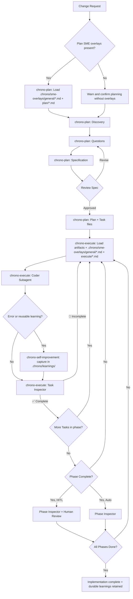

# Chrono

**Plan and implement software changes using structured GitHub Copilot skills**

Chrono provides two GitHub Copilot skills for software engineers that transform how you plan and
implement complex software changes in VS Code.

Instead of endless manual prompting, Chrono provides structured workflows
that ensure quality through systematic planning, autonomous implementation,
and continuous validation.

## Skills

- **`chrono-plan`**: An interview-based planning skill that produces reviewable specifications
  and actionable task breakdowns.
- **`chrono-execute`**: An orchestration skill that autonomously implements tasks
  with continuous verification (the "Ralph Loop").

In this repository, the source skill files live under `skills/` and the installer copies them to
`~/.agents/skills/` for use in GitHub Copilot.

Chrono's built-in skills are deliberately foundational. Teams are expected to layer
project-specific subject matter expertise on top so the same workflow can fit different domains,
compliance regimes, testing rules, and release constraints.

## Why Chrono?

Chrono gives GitHub Copilot a **repeatable workflow for real software delivery**.

Instead of relying on long ad hoc prompts and fragile chat memory, Chrono breaks work into explicit phases with durable artifacts: request, specification, plan, task files, progress tracking, and verification.

That structure creates three practical advantages:

### 1. Clear planning before code

`chrono-plan` turns a rough request into a concrete specification and technical plan before implementation begins. That reduces ambiguity, forces important decisions early, and gives humans something reviewable before code starts landing.

### 2. Execution that stays on track

`chrono-execute` runs implementation as a controlled loop: pick the next task, delegate it, verify the result, record progress, and continue. The workflow is explicit, stateful, and resumable, so progress does not depend on one chat thread staying coherent forever.

### 3. Traceability from request to delivery

Chrono organizes work in a predictable folder structure such as `.agents/changes/JIRA-123-description/`, making it easy to connect the original request, the design decisions, the implementation tasks, and the final progress record. That makes review, handoff, and recovery much easier than prompt-only workflows.

Inspired by the **["Ralph Wiggum" pattern](https://www.humanlayer.dev/blog/brief-history-of-ralph)**, Chrono adapts that delegation loop for **VS Code GitHub Copilot** and adds the planning, progress management, and validation layers needed for larger changes.

## Core Skills

Chrono provides two complementary skills:

### 📋 `chrono-plan`

**A research and planning skill that produces reviewable specifications and actionable task breakdowns.**

`chrono-plan` systematically explores your change request through:

1. **Deep context discovery** — scans your project structure, documentation, and existing patterns
2. **Structured interviews** — asks 10-15 clarifying questions, then 5-10 technical follow-ups
3. **Specification generation** — produces a reviewable spec with requirements, constraints, and success criteria
4. **Implementation planning** — creates detailed architectural plan with dependencies
5. **Task breakdown** — generates independent, actionable task files for `chrono-execute`

**Output artifacts** (in `.agents/changes/<JIRA>-<description>/`):

```text
.agents/changes/JIRA-123-feature-name/
├── 00.jira-request.txt        # Initial change request
├── 01-specification.md        # Reviewable design decisions and requirements
├── 02-plan.md                 # Technical architecture and dependencies
├── 03-tasks-00-READBEFORE.md  # Critical context for all tasks
├── 03-tasks-01-models.md      # Phase 1, Task 1: Data models
├── 03-tasks-02-api.md         # Phase 1, Task 2: API endpoints
├── 03-tasks-03-tests.md       # Phase 2, Task 3: Unit tests
└── 03-tasks-04-docs.md        # Phase 2, Task 4: Documentation
```

**Key principle**: `chrono-plan` **never writes implementation code**. It focuses exclusively on thorough planning so implementation agents have clear, complete instructions.

**Files Description**:

- `00.jira-request.txt`: The initial human request, often a poorly written JIRA ticket.
- `01-specification.md`: The main output of Plan Mode, containing reviewable design and architectural choices without technical details or code.
- `01-specification.jira.txt`: A JIRA-friendly version of the specification
  for easy putting issues in review in JIRA.
- `02-plan.md`: A highly technical architecture plan that includes task dependencies
  and low-level details. This file is never used after task breakdown is finished.
- `03-tasks-00-READBEFORE.md`: critical context and instructions for all tasks,
  including applicable coding standards, testing requirements, and implementation guidelines.
  These guidelines may be loaded using progressive disclosure by implementation agents
  to ensure consistent adherence to standards.
- `03-tasks-XX-*.md`: individual task files, each containing a single independent task
  with just enough context for a fresh agent to implement it.
  Tasks are grouped into phases, but each task file is self-contained
  to reduce cognitive overload and token waste.

### ⚙️ `chrono-execute`

**An orchestration skill that autonomously implements tasks with continuous verification (the "Ralph Loop").**

`chrono-execute` manages the complete implementation lifecycle:

1. **Reads planning artifacts** — loads spec, plan, and task files from `chrono-plan`
2. **Delegates to Coder subagent** — selects next task, triggers implementation subagent
3. **Runs Task Inspector** — verifies each completed task meets acceptance criteria
4. **Manages phase transitions** — validates phase completion before proceeding
5. **Human-in-the-Loop (HITL)** — optional pause points for stakeholder review
6. **Progress tracking** — maintains `PROGRESS.md` with task status and validation notes

**Two operational modes**:

- **Auto Mode** (default) — continuous implementation until all tasks complete
- **HITL Mode** (Human-in-the-loop) — pauses at phase boundaries for human review

**Three-tier quality assurance**:

- **Preflight checks** — run by the Coder before marking any task complete
- **Task Inspector** — validates individual task completion after each Coder run
- **Phase Inspector** — validates phase completion before advancing

At the end of each coding task AND after each review, a commit is generated.
It is recommended to squash all these commits into a single self-contained commit before merging.

## Supporting Community Skills

Chrono also ships the following open-source community skills that its core skills leverage:

- **`find-docs`** (`.github/skills/find-docs/`) — fetches current library documentation via `ctx7`
- **`playwright-cli`** (`.github/skills/playwright-cli/`) — browser automation for UI task verification
- **`ui-ux-pro-max`** (`.github/prompts/ui-ux-pro-max/`) — design system generation prompt
- **`chrono-self-improvement`** (`skills/chrono-self-improvement/`) — captures learnings, errors, and corrections to enable continuous improvement across the full Chrono workflow (adapted from [self-improvement](https://github.com/pskoett/pskoett-ai-skills/blob/main/skills/self-improvement/SKILL.md))

`chrono-plan` invokes `find-docs` and `ui-ux-pro-max` when relevant.
`chrono-execute` invokes `playwright-cli` for any task that involves UI or front-end work.
`chrono-self-improvement` is a general-purpose Chrono workflow skill that can be invoked by any
agent when it encounters an error or learns something new. It captures that learning in a
structured format so the agent can refer back to it later and improve over time.

## Subagent Personas

`chrono-execute` orchestrates three subagent personas internally:

- **Coder**: implements individual tasks based on task files
- **Task Inspector**: verifies task completion against acceptance criteria
- **Phase Inspector**: validates phase completion and generates review reports

The orchestrator never codes itself — it only tracks progress and delegates.

## Project-Local SME Overlays

Keep team-specific guidance outside the installed skill directories so Chrono can be updated
without overwriting your project's expertise.

Use this repository-local structure:

```text
.chrono/
├── learnings/
│   ├── LEARNINGS.md
│   ├── ERRORS.md
│   └── FEATURE_REQUESTS.md
└── sme-overlays/
   ├── README.md
   ├── general/
   │   └── terminology.md
   ├── plan/
   │   ├── architecture.md
   │   └── compliance.md
   └── execute/
      ├── shared-release.md
      ├── coder-testing.md
      └── inspector-accessibility.md
```

How Chrono uses these overlays:

- `chrono-plan` reads every Markdown file in `.chrono/sme-overlays/general/` and
   `.chrono/sme-overlays/plan/` before discovery and uses that guidance when it asks questions,
   writes the specification, builds the plan, and creates tasks.
- Before planning, `chrono-plan` ignores scaffold `README.md` files and checks whether any real
   SME overlays exist under `.chrono/sme-overlays/`. If none exist, it warns the user and asks
   whether to continue planning without SME guidance.
- `chrono-execute` reads every Markdown file in `.chrono/sme-overlays/general/` and
   `.chrono/sme-overlays/execute/` on each loop iteration.
- In `.chrono/sme-overlays/general/`, every Markdown file applies to both `chrono-plan` and
   `chrono-execute`.
- In `.chrono/sme-overlays/execute/`, files without a prefix and files named `shared-*.md` apply
   to all execution subagents.
- Files named `coder-*.md` apply only to the Coder subagent.
- Files named `inspector-*.md` apply only to the Task Inspector and Phase Inspector.
- `chrono-self-improvement` stores reusable learnings in `.chrono/learnings/`.

Typical things to put in overlays:

- Domain rules the generic skill cannot infer, such as payments, healthcare, infra, or security constraints.
- Repository-specific architecture rules, rollout requirements, and forbidden implementation patterns.
- Testing and verification expectations, such as required smoke checks, release evidence, or audit notes.
- Team review heuristics, such as accessibility gates, migration checklists, or incident-prevention rules.

Practical guidance:

- Keep overlays concise, directive, and specific to the project.
- Prefer one topic per file so teams can update rules independently.
- Treat overlays as additive constraints on top of the core Chrono workflow, not as replacements for it.
- If you upgrade Chrono, keep your `.chrono/` directory unchanged and replace only the installed skills.

Choose the right home for guidance:

- Use `AGENTS.md` or repo instructions when the rule should shape most work in the repository, even outside Chrono.
- Use SME overlays when the rule is project-local expertise that should be injected into `chrono-plan` or `chrono-execute` at the right phase or subagent boundary.
- Use a skill when the behavior is a reusable workflow or capability that should be discovered and invoked as its own tool, rather than always loaded by Chrono.
- Do not move generic coding conventions into overlays just because Chrono can read them; overlays are for Chrono-scoped constraints, not a second general instructions system.

## Installation

Run the installer:

```bash
npx -y chrono-cli@latest init
```

The installer will:

- Install the Chrono core skills globally
- Seed a project-local `.chrono/` scaffold into the directory where you ran the installer if it does not already exist
- Install `@playwright/cli` and related skills globally
- Install `ui-ux-pro-max` skills globally
- Install `ctx7` skills globally and initialize
- Prompt you to add optional project-local SME overlays under `.chrono/sme-overlays/general/`, `.chrono/sme-overlays/plan/`, and `.chrono/sme-overlays/execute/`

## Quick Start

### Planning a Change

1. In Copilot Chat, invoke the `chrono-plan` skill:
   > `/chrono-plan add user authentication`

2. Optionally, create a request file first:
   ```bash
   mkdir -p .agents/changes/JIRA-123-my-feature
   echo "Add OAuth login with GitHub" > .agents/changes/JIRA-123-my-feature/00.jira-request.txt
   ```

3. Answer the clarifying questions (10–15 in Phase 2, 5–10 in Phase 3)
4. Review the generated specification in `.agents/changes/JIRA-123-my-feature/01-specification.md`
5. Approve the plan and task breakdown

### Implementing with `chrono-execute`

1. In Copilot Chat, invoke the `chrono-execute` skill:
   > `/chrono-execute implement .agents/changes/JIRA-123-my-feature/`

   To enable HITL mode (pauses at phase boundaries for review):
   > `/chrono-execute HITL mode .agents/changes/JIRA-123-my-feature/`

2. `chrono-execute` will:
   - Read spec, plan, and tasks from the folder
   - Delegate implementation to Coder subagents
   - Verify each task with the Task Inspector
   - Track progress in `PROGRESS.md`
   - Continue until all tasks complete

**Pausing**: Create `PAUSE.md` in the planning folder to safely pause the loop for manual task edits.

## Concrete Advice

- Start with a small request in `.agents/changes/JIRA-123-description/00.jira-request.txt`
- Use a mid-size model like Claude Sonnet 4.5 for `chrono-plan`
- Reserve Opus only when tasks require complex reasoning or multi-phase implementation (20+ tasks)
- Use Claude Haiku for implementation. Sonnet for `chrono-execute` consumes roughly 1 premium request
  per ~15 tasks + reviews based on observed usage

## Typical End-to-End Workflow



## Honest Feedback: Current Limitations

Chrono is a **production-level proof of concept**.
It works, I use it daily in my workflow — but it's not perfect.

In this section, I humbly document the real limitations and known issues
of the current implementation.

I would be grateful if you tried it out and shared your feedback,
especially if you have suggestions for improvement.

### Known Issues

1. **Task selection autonomy**: The orchestrator sometimes chooses tasks and
   sends task numbers to the Coder subagent, despite instructions stating
   "let the subagent choose". This creates unnecessary coupling.

2. **Rate limit recovery failures**: When hitting GitHub Copilot daily/weekly rate limits, retry behavior degrades:
   - Orchestrator "forgets" to trigger subagents
   - Implementation happens in orchestrator instead of Coder subagent
   - **Workaround**: Start a fresh chat session

3. **Feature completeness vs. accessibility gap**: The most significant limitation — at completion:
   - ✅ All features are typically implemented
   - ✅ Complete preflight checks pass
   - ✅ Unit tests pass
   - ✅ Code quality is high
   - ❌ **But features may not be user-accessible** (especially with UI)

   Despite intensive planning and no visible gaps in specifications,
   implemented features sometimes exist in code but lack integration points, UI bindings,
   or entry points for users to actually use them.

   A human would have caught this gap during implementation,
   but the agent still misses it.

---

## Acknowledgments

Inspired by the "Ralph Wiggum" loop concept and refined through experimentation with GitHub Copilot's Agent Mode system.

**Read more**:

- [Original Reddit post](https://www.reddit.com/r/GithubCopilot/comments/1qapkdg/ralph_wiggum_technic_in_vs_code_copilot_with/)
- [X/Twitter thread](https://x.com/stibbons31/status/2020456046259589229)
