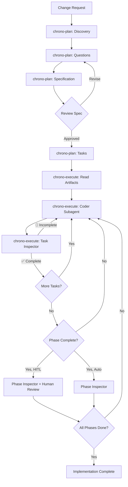

# Chrono

**Plan and implement software changes using structured GitHub Copilot skills**

Chrono provides two GitHub Copilot skills for software engineers that transform how you plan and
implement complex software changes in VS Code.

Instead of endless manual prompting, Chrono provides structured workflows
that ensure quality through systematic planning, autonomous implementation,
and continuous validation.

## Skills

- **`chrono-plan`**: An interview-based planning skill that produces reviewable specifications
  and actionable task breakdowns.
- **`chrono-execute`**: An orchestration skill that autonomously implements tasks
  with continuous verification (the "Ralph Loop").

Both skills are in `.github/skills/` and work together end-to-end.

## Why Chrono?

Chrono is an **experiment in structured agent orchestration**, exploring three key questions:

### 1. Can models reliably follow complex workflows?

Using **structured prompts and explicit phase boundaries**, Chrono tests whether LLMs can execute multi-phase processes (discovery → interview → specification → planning → implementation → verification) without losing track of their role or breaking the workflow.

### 2. Can we integrate external issue trackers seamlessly?

Real teams use JIRA, Linear, or GitHub Issues.
Chrono uses the **JIRA-ID naming convention** (`.agents/changes/JIRA-123-description/`)
to maintain traceability between planning artifacts and external project management systems.

### 3. Can we implement using a Ralph Wiggum loop directly in GitHub Copilot?

Inspired by the **["Ralph Wiggum" pattern](https://www.humanlayer.dev/blog/brief-history-of-ralph)**,
a simple loop that repeatedly delegates to subagents until all tasks are complete.

Chrono adapts this approach for **VS Code GitHub Copilot**.

Instead of:

- Writing new prompts for each implementation step
- Manually tracking which tasks are done
- Hoping the agent remembers earlier context

**`chrono-execute`** does:

- Read the progress file
- Delegate next task to a fresh Coder subagent
- Verify the result with an Inspector subagent
- Update progress
- Repeat until complete

This is **linear, stateful, and autonomous** — you start the loop and step away.

## Core Skills

Chrono provides two complementary skills:

### 📋 `chrono-plan`

**A research and planning skill that produces reviewable specifications and actionable task breakdowns.**

`chrono-plan` systematically explores your change request through:

1. **Deep context discovery** — scans your project structure, documentation, and existing patterns
2. **Structured interviews** — asks 10-15 clarifying questions, then 5-10 technical follow-ups
3. **Specification generation** — produces a reviewable spec with requirements, constraints, and success criteria
4. **Implementation planning** — creates detailed architectural plan with dependencies
5. **Task breakdown** — generates independent, actionable task files for `chrono-execute`

**Output artifacts** (in `.agents/changes/<JIRA>-<description>/`):

```text
.agents/changes/JIRA-123-feature-name/
├── 00.jira-request.txt        # Initial change request
├── 01-specification.md        # Reviewable design decisions and requirements
├── 02-plan.md                 # Technical architecture and dependencies
├── 03-tasks-00-READBEFORE.md  # Critical context for all tasks
├── 03-tasks-01-models.md      # Phase 1, Task 1: Data models
├── 03-tasks-02-api.md         # Phase 1, Task 2: API endpoints
├── 03-tasks-03-tests.md       # Phase 2, Task 3: Unit tests
└── 03-tasks-04-docs.md        # Phase 2, Task 4: Documentation
```

**Key principle**: `chrono-plan` **never writes implementation code**. It focuses exclusively on thorough planning so implementation agents have clear, complete instructions.

**Files Description**:

- `00.jira-request.txt`: The initial human request, often a poorly written JIRA ticket.
- `01-specification.md`: The main output of Plan Mode, containing reviewable design and architectural choices without technical details or code.
- `01-specification.jira.txt`: A JIRA-friendly version of the specification
  for easy putting issues in review in JIRA.
- `02-plan.md`: A highly technical architecture plan that includes task dependencies
  and low-level details. This file is never used after task breakdown is finished.
- `03-tasks-00-READBEFORE.md`: critical context and instructions for all tasks,
  including applicable coding standards, testing requirements, and implementation guidelines.
  These guidelines may be loaded using progressive disclosure by implementation agents
  to ensure consistent adherence to standards.
- `03-tasks-XX-*.md`: individual task files, each containing a single independent task
  with just enough context for a fresh agent to implement it.
  Tasks are grouped into phases, but each task file is self-contained
  to reduce cognitive overload and token waste.

### ⚙️ `chrono-execute`

**An orchestration skill that autonomously implements tasks with continuous verification (the "Ralph Loop").**

`chrono-execute` manages the complete implementation lifecycle:

1. **Reads planning artifacts** — loads spec, plan, and task files from `chrono-plan`
2. **Delegates to Coder subagent** — selects next task, triggers implementation subagent
3. **Runs Task Inspector** — verifies each completed task meets acceptance criteria
4. **Manages phase transitions** — validates phase completion before proceeding
5. **Human-in-the-Loop (HITL)** — optional pause points for stakeholder review
6. **Progress tracking** — maintains `PROGRESS.md` with task status and validation notes

**Two operational modes**:

- **Auto Mode** (default) — continuous implementation until all tasks complete
- **HITL Mode** (Human-in-the-loop) — pauses at phase boundaries for human review

**Three-tier quality assurance**:

- **Preflight checks** — run by the Coder before marking any task complete
- **Task Inspector** — validates individual task completion after each Coder run
- **Phase Inspector** — validates phase completion before advancing

At the end of each coding task AND after each review, a commit is generated.
It is recommended to squash all these commits into a single self-contained commit before merging.

## Supporting Community Skills

Chrono also ships the following open-source community skills that its core skills leverage.
These are **not part of this project** — they are included for convenience:

- **`find-docs`** (`.github/skills/find-docs/`) — fetches current library documentation via `ctx7`
- **`playwright-cli`** (`.github/skills/playwright-cli/`) — browser automation for UI task verification
- **`ui-ux-pro-max`** (`.github/prompts/ui-ux-pro-max/`) — design system generation prompt

`chrono-plan` invokes `find-docs` and `ui-ux-pro-max` when relevant.
`chrono-execute` invokes `playwright-cli` for any task that involves UI or front-end work.

## Subagent Personas

`chrono-execute` orchestrates three subagent personas internally:

- **Coder**: implements individual tasks based on task files
- **Task Inspector**: verifies task completion against acceptance criteria
- **Phase Inspector**: validates phase completion and generates review reports

The orchestrator never codes itself — it only tracks progress and delegates.

## Installation

Copy the two core skills into your project's `.github/skills/` directory:

```bash
cd /path/to/your-project
mkdir -p .github/skills

# Core skills (required)
cp -R ~/Projects/chrono/.github/skills/chrono-plan  .github/skills/
cp -R ~/Projects/chrono/.github/skills/chrono-execute .github/skills/

# Optional: community skills leveraged by Chrono
cp -R ~/Projects/chrono/.github/skills/find-docs    .github/skills/
cp -R ~/Projects/chrono/.github/skills/playwright-cli .github/skills/
cp -R ~/Projects/chrono/.github/prompts/ui-ux-pro-max .github/prompts/
```

GitHub Copilot will automatically discover skills in `.github/skills/` and make them available in chat.

## Quick Start

### Planning a Change

1. In Copilot Chat, invoke the `chrono-plan` skill:
   > "Plan this change" or "chrono-plan: add user authentication"

2. Optionally, create a request file first:
   ```bash
   mkdir -p .agents/changes/JIRA-123-my-feature
   echo "Add OAuth login with GitHub" > .agents/changes/JIRA-123-my-feature/00.jira-request.txt
   ```

3. Answer the clarifying questions (10–15 in Phase 2, 5–10 in Phase 3)
4. Review the generated specification in `.agents/changes/JIRA-123-my-feature/01-specification.md`
5. Approve the plan and task breakdown

### Implementing with `chrono-execute`

1. In Copilot Chat, invoke the `chrono-execute` skill:
   > "chrono-execute: implement .agents/changes/JIRA-123-my-feature/"

   To enable HITL mode (pauses at phase boundaries for review):
   > "chrono-execute HITL mode: .agents/changes/JIRA-123-my-feature/"

2. `chrono-execute` will:
   - Read spec, plan, and tasks from the folder
   - Delegate implementation to Coder subagents
   - Verify each task with the Task Inspector
   - Track progress in `PROGRESS.md`
   - Continue until all tasks complete

**Pausing**: Create `PAUSE.md` in the planning folder to safely pause the loop for manual task edits.

## Concrete Advice

- Start with a small request in `.agents/changes/JIRA-123-description/00.jira-request.txt`
- Use a mid-size model like Claude Sonnet 4.5 for `chrono-plan`
- Reserve Opus only when tasks require complex reasoning or multi-phase implementation (20+ tasks)
- Use Claude Haiku for implementation. Sonnet for `chrono-execute` consumes roughly 1 premium request
  per ~15 tasks + reviews based on observed usage

## Typical End-to-End Workflow



## Honest Feedback: Current Limitations

Chrono is a **production-level proof of concept**.
It works, I use it daily in my workflow — but it's not perfect.

In this section, I humbly document the real limitations and known issues
of the current implementation.

I would be grateful if you tried it out and shared your feedback,
especially if you have suggestions for improvement.

### Known Issues

1. **Task selection autonomy**: The orchestrator sometimes chooses tasks and
   sends task numbers to the Coder subagent, despite instructions stating
   "let the subagent choose". This creates unnecessary coupling.

2. **Rate limit recovery failures**: When hitting GitHub Copilot daily/weekly rate limits, retry behavior degrades:
   - Orchestrator "forgets" to trigger subagents
   - Implementation happens in orchestrator instead of Coder subagent
   - **Workaround**: Start a fresh chat session

3. **Feature completeness vs. accessibility gap**: The most significant limitation — at completion:
   - ✅ All features are typically implemented
   - ✅ Complete preflight checks pass
   - ✅ Unit tests pass
   - ✅ Code quality is high
   - ❌ **But features may not be user-accessible** (especially with UI)

   Despite intensive planning and no visible gaps in specifications,
   implemented features sometimes exist in code but lack integration points, UI bindings,
   or entry points for users to actually use them.

   A human would have caught this gap during implementation,
   but the agent still misses it.

---

## Acknowledgments

Inspired by the "Ralph Wiggum" loop concept and refined through experimentation with GitHub Copilot's Agent Mode system.

**Read more**:

- [Original Reddit post](https://www.reddit.com/r/GithubCopilot/comments/1qapkdg/ralph_wiggum_technic_in_vs_code_copilot_with/)
- [X/Twitter thread](https://x.com/stibbons31/status/2020456046259589229)
